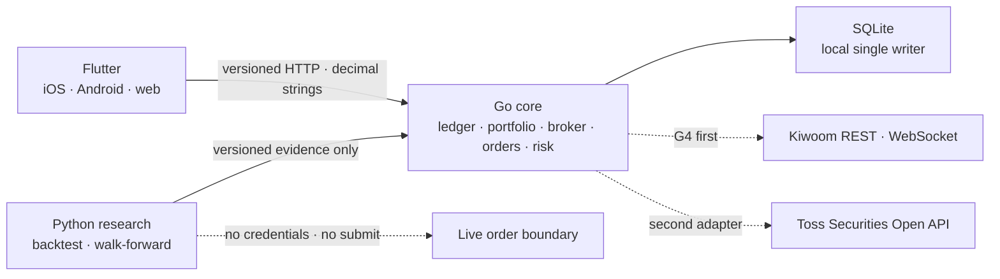

# Omni-Folio

개인용 멀티 증권 포트폴리오와 안전한 자동매매를 위한 local-first 플랫폼입니다. Flutter 하나로 iOS·Android·web을 제공하고, Go가 원장·브로커·주문·리스크의 권한을 소유하며, Python은 재현 가능한 연구와 백테스트만 담당합니다.

> [!IMPORTANT]
> 현재 실거래와 브로커 연결은 비활성입니다. 이 저장소의 백테스트·전략 결과는 수익을 보장하지 않으며 투자 조언이 아닙니다.

## 현재 상태

| Gate | 상태 | 증거 |
|---|---|---|
| G0 아키텍처·계약 | 통과 | versioned OpenAPI/JSON Schema, runtime ADR, root commands |
| G1 로컬 원장 | 통과 | CSV preview → atomic apply → exact cash/trade/dividend/tax/split/FX replay → append-only cash void → direct FX observation → cash-only direct-FX valuation → durable security price observation → snapshot/receipt → schema v11/backup v7와 legacy v8/v9/v10 owned-copy migration restore proof |
| G2 Flutter client | 부분 통과 | iOS·Android·web release build와 자동 parser/widget 테스트 통과; chart 포함 Android emulator build/raster p95 2회 통과, physical-device·수동 screen-reader 및 test-instrumentation 격리 증거 남음 |
| G3 research | 통과 | deterministic backtest, expanding walk-forward, final holdout, append-only candidate registry, exact selection-bound order authority, credential-free paper execution, atomic halt/rollback safety |
| G4 broker·chart·order | 진행 중 | K0 read, local sample OHLCV/Flutter 차트, K1 credential-free candle, G4D price basis, G4E/K2A 주문 상태, G4F/K2B0 알려진 주문 체결 조정, G4G/K2B1 날짜 지정 체결 스캔, G4H known-good snapshot, G4I/K2C 내부 합성 authority, G4J/K2B2 credential-free mock 지정가 submit, G4K 저장된 보유수량 대조 read view, G4L 검증된 로컬 주문 lifecycle read view, G4M 홈 저장 대조 신뢰 요약, G4N pending-action 안전 경고, G4O local daily chart 표시 범위, G4P 첫 실행 import 복구 경로 통과. 실제 키움 credentialed 시세·모의주문 관찰, freshness/scheduling, unknown-submit 조회 복구, 주문 mutation UI, production risk와 모든 live gate는 남는다. |

세부 상태와 완료 조건은 [`PLAN.md`](PLAN.md)와 [`GATES.md`](GATES.md)에서 관리합니다.

## 아키텍처



- Flutter와 Python에는 증권사 credential이나 주문 제출 권한이 없습니다.
- Go core만 canonical 원장과 주문 상태를 변경할 수 있습니다.
- SQLite는 로컬 단일 writer 단계의 의도적인 선택입니다. PostgreSQL migration·restore·load evidence 전에는 multi-replica나 Kubernetes manifest를 만들지 않습니다.
- G6 진입 뒤의 로컬 Kubernetes 검증 기준은 `Kind + Podman`입니다. 현재 Kind 클러스터는 provision하지 않았고, G6 증거 전에는 manifest도 만들지 않습니다.
- 토스증권의 쉬운 용어와 차분한 정보 위계를 참고하되 화면·상표·trade dress는 복제하지 않습니다.

결정 근거는 [`docs/adr/0001-runtime-and-monorepo.md`](docs/adr/0001-runtime-and-monorepo.md), 브로커 순서와 UX 계약은 [`docs/broker-priority-and-ux.md`](docs/broker-priority-and-ux.md)를 따릅니다.

## 빠른 시작

필요한 도구:

- GNU Make 3.81+
- asdf 0.20+
- `curl`
- Docker Engine + Compose v2 (컨테이너 실행 시에만 필요)

프로젝트의 [`.tool-versions`](.tool-versions)는 Flutter 3.47.1 stable, Go 1.24.5, Python 3.14.5를 고정합니다. Python research runtime에는 제3자 패키지가 없습니다.

```sh
git clone https://github.com/YouSangSon/Omni-Folio.git
cd Omni-Folio
asdf install
make bootstrap
make check
make smoke
```

`make check`는 성공·실패와 관계없이 검사 중 생성한 Flutter build/coverage, Python bytecode와 로컬 Go 바이너리를 정리합니다. `make smoke`는 임시 SQLite 파일에서 health, readiness, CSV preview, atomic apply, snapshot, local sample OHLCV를 확인하고 종료할 때 프로세스와 데이터를 제거합니다. 전체 Flutter/QA 캐시까지 비우려면 `make clean`을 사용합니다.

### 앱 실행

첫 번째 터미널:

```sh
make run-core WEB_ORIGIN=http://localhost:8081
```

두 번째 터미널:

```sh
make run-client
```

- API: `http://127.0.0.1:8080`
- Flutter web: `http://localhost:8081`
- local DB: `data/omni-folio.db`

`make run-core`는 `contracts/fixtures/market-bars.csv`를 명시적으로 전달하므로 AAPL 보유 항목에서 샘플 종목 차트를 확인할 수 있습니다. 화면과 API 모두 이를 `샘플 데이터 · 실시간 아님`으로 표시합니다. fixture 없이 fail-closed 동작을 확인하려면 `make run-core MARKET_FIXTURE=`를 사용합니다.

다른 API 포트를 사용할 때는 core와 client를 함께 바꿉니다.

```sh
make run-core CORE_ADDR=127.0.0.1:18080 WEB_ORIGIN=http://localhost:8081
make run-client API_URL=http://127.0.0.1:18080
```

`OMNI_API_URL`은 Flutter build-time 값이며 secret을 넣으면 안 됩니다. Make는 `.env`를 자동으로 읽지 않습니다.

## 검증 가능한 수직 슬라이스

### CSV import

Preview는 원장을 변경하지 않습니다. 반환된 `preview_id`를 새 idempotency key와 함께 apply합니다.

CSV type은 `DEPOSIT`, `WITHDRAWAL`, `BUY`, `SELL`, `DIVIDEND`, `FEE`, `TAX`, `SPLIT`, `CASH_VOID`, `FX_EXCHANGE`입니다. 금액과 수량은 canonical decimal string이며, 현금 event 부호와 split의 zero cash impact는 apply 전에 검증됩니다. `CASH_VOID`만 optional `corrects_source_event_id` column을 사용하며, 이미 적용된 같은 계좌·통화 cash-like event의 exact 반대 금액이어야 합니다. 원본은 삭제되지 않고 Flutter preview에 원본 source/type/currency/amount와 상쇄 금액이 함께 표시됩니다. `FX_EXCHANGE`는 매도 leg의 `currency`/음수 `amount`와 서로 다른 매수 leg의 `counter_currency`/양수 `counter_amount`를 하나의 행에 요구합니다. 두 금액은 환율이나 현재 시세를 뜻하지 않으며 수수료는 별도 `FEE` 행으로 기록합니다.

```sh
preview_file="$(mktemp)"
curl -fsS -X POST \
  -H 'Content-Type: text/csv' \
  --data-binary @contracts/fixtures/golden-import.csv \
  http://127.0.0.1:8080/v1/imports/preview > "$preview_file"

preview_id="$(python3 -c 'import json,sys; print(json.load(open(sys.argv[1]))["preview_id"])' "$preview_file")"
curl -fsS -X POST \
  -H 'Content-Type: application/json' \
  --data "{\"preview_id\":\"$preview_id\",\"idempotency_key\":\"local-apply-001\"}" \
  http://127.0.0.1:8080/v1/imports/apply

curl -fsS http://127.0.0.1:8080/v1/portfolio/snapshot
rm -f "$preview_file"
```

Golden fixture의 기대값은 신규 3행, revision `rev_0000000003`, USD cash `778`, AAPL 6주, cost basis `300.6`입니다. 동적 ID와 timestamp는 매 실행마다 달라집니다.

### Local sample OHLCV chart

```sh
curl -fsS 'http://127.0.0.1:8080/v1/market-data/candles?symbol=AAPL&interval=1d'
```

응답은 canonical decimal string과 함께 `price_adjustment=unspecified`, `source=local_fixture`, `sample=true`, `state=stale`를 반환합니다. 보유 화면에서 AAPL을 열면 가격·거래량 chart, 마지막 수신 봉 기준 `30일/90일/365일/전체` 표시 범위, 가격 조정 기준, source/as-of, screen-reader summary와 선택 범위를 공유하는 정확한 OHLCV 표를 볼 수 있습니다. `unspecified`는 가격 조정 여부를 확인하지 못했다는 뜻입니다. 이 client-side 범위 선택은 새 시세 조회나 candle completeness를 뜻하지 않으며, fixture는 계약·UI 검증용일 뿐 현재 시세나 투자 판단 자료가 아닙니다.

### Direct FX observation foundation

G1.10은 `1 base_currency = rate quote_currency` 방향의 환율 관측값을 schema v10 `STRICT`/insert-only series에 보존합니다. source observation identity, exact decimal rate, observed/fetched/recorded UTC 시각과 canonical row hash를 검증하며 같은 source·pair·observed-at 충돌을 거절합니다. `GET /v1/market-data/fx/latest`는 explicit `as_of` 이전에 관측되고 수신된 exact 방향만 반환하고 `sample=true`, `state=stale`를 유지합니다. 반대 방향을 자동 역산하거나 `FX_EXCHANGE` cash leg를 환율로 사용하지 않습니다.

현재 writer는 Go 내부 테스트 경계뿐이며 provider ingestion·public mutation·scheduler·Flutter 평가 화면은 없습니다. 따라서 이 route는 저장 계약을 검증하는 기반이지 사용 가능한 현재 환율 feed가 아닙니다. `PortfolioSnapshot.valuation_status`도 계속 `unavailable`입니다.

### Direct-FX cash valuation

G1.11의 `GET /v1/portfolio/cash-valuation`은 replay-verified 현재 원장 cash를 요청한 기준통화로만 평가합니다. canonical UTC `as_of`와 `base_currency`를 필수로 받고, 같은 읽기 transaction에서 원장 event와 FX series 전체를 검증합니다. 동일 통화와 0 잔액 외에는 `cash currency -> base currency` 방향의 직접 관측만 사용하며, 관측 시각부터 24시간 경계를 포함합니다. inverse·cross·interpolation·`FX_EXCHANGE` 추론과 표시용 반올림은 사용하지 않습니다.

누락되거나 24시간보다 오래된 pair가 하나라도 있으면 native cash line과 문제만 반환하고 aggregate total은 숨깁니다. local fixture를 사용한 완전한 결과도 `sample=true`, `status=stale_sample`입니다. 이 API는 현금 전용이며 보유자산·손익·성과·현재 시세를 평가하지 않고 Flutter 화면에도 연결하지 않았습니다. `PortfolioSnapshot.valuation_status`는 계속 `unavailable`입니다.

```sh
curl -fsS 'http://127.0.0.1:8080/v1/portfolio/cash-valuation?base_currency=KRW&as_of=2026-01-11T14:00:00Z'
```

### Durable security price observation foundation

G1.12는 보유자산 평가에 앞서 local fixture 종목 가격을 schema v11 `STRICT`/insert-only series에 보존합니다. source identity, instrument ID, symbol, venue, currency, positive canonical price, `price_adjustment=unspecified`, observed/fetched/recorded UTC 시각과 canonical row hash를 검증합니다. 내부 exact-as-of 조회는 모든 identity 차원을 고정하고 세 시각이 cutoff 이하인 관측만 선택합니다.

Backup v7은 가격 series digest/count를 검증하며 v6/schema-v10 artifact는 원본을 바꾸지 않는 owned copy에서 v11로 migration합니다. 빈 restore 후보도 embedded migration과 동일한 table DDL·latest index·insert-only trigger를 요구합니다. public API, Flutter 화면, provider 요청, scheduler, 보유·손익·성과 평가는 추가하지 않았고 `PortfolioSnapshot.valuation_status`는 계속 `unavailable`입니다.

### Internal synthetic order recovery, execution authority, reconciliation, and mock submit

K2A/K2B0는 Go 내부에서 Kiwoom `LIMIT`/`KRW`/`KRX` intent와 append-only lifecycle, `SUBMIT_UNKNOWN` 중복 방지, cancel/fill replay와 이미 알려진 주문번호의 원자적 체결 조정을 검증합니다. K2B1은 명시 날짜의 synthetic `kt00009` 체결 row를 non-joinable scan으로 보존합니다. K2C는 기본 차단 kill switch, 프로세스별 lease/fencing, `005930`·`000660` BUY의 10주·주문 100만 원·계좌 활성 예약 100만 원 한도를 검증합니다. K2B2는 합성 credential과 in-memory transport로 공식 `kt10000` mock 지정가 요청을 재현하며 token preflight, durable dispatch-before-write, write 무재시도, opaque ACK와 unknown/reject 분기를 검증합니다. 외부 broker 호출, public 주문 API/UI와 live 권한은 없습니다.

```sh
cd services/core
go test -run '^(TestK2A|TestK2B0|TestK2B1|TestK2B2|TestK2C)' -count=1 ./...
```

K2B0는 속성·시간이 같은 주문이 보여도 주문번호 없는 `SUBMIT_UNKNOWN`을 결합하지 않습니다. K2B1의 terminal pagination도 전체 체결 이력 완료를 뜻하지 않으며 날짜와 timezone 없는 체결 시각을 합쳐 UTC를 만들지 않습니다. K2B2의 write는 401을 포함해 자동 재시도하지 않으며 결과가 불명확하면 재주문 대신 조회·reconciliation을 기다립니다. 실제 credentialed mock 관찰, unknown-submit 조회 복구, cash·position·fee·손실·시장시간·stale-data 한도, owner/strategy 승인, broker/ledger reconciliation과 Flutter 주문 흐름은 남아 있습니다.

### Credential-free known-good broker snapshot

G4H는 기존 합성 `KiwoomSnapshot` 중 `complete=true`인 KRX snapshot만 Go 내부 SQLite에 원자 저장합니다. 같은 account/environment/exchange/fetched-at와 같은 payload는 raw snapshot을 중복 저장하지 않고, ledger revision별 reconciliation record를 별도로 남깁니다. payload 충돌이나 불완전 snapshot은 이전 known-good를 바꾸지 않습니다. 저장 시점 ledger revision의 KRX/KRW 종목 수량과 broker 수량 차이를 exact decimal로 고정합니다.

```sh
cd services/core
go test -run '^TestG4H' -count=1 ./...
```

현재 schema v11/backup v7은 ledger event, cash-void/FX guard, direct FX observation, security price observation, raw broker snapshot, revisioned broker reconciliation, execution-authority event, risk reservation, strategy registry와 synthetic/paper 주문을 insert-only로 보호하고 각각의 digest/count와 replay 가능한 canonical record를 restore 후보에서 검증합니다. legacy v5/schema-v8·v9 및 v6/schema-v10 backup은 원본을 수정하지 않는 owned copy를 v11로 migration해 같은 restore proof를 적용합니다. G4H 자체는 credential, broker request, scheduling, 공식 freshness/timezone, 현금·평가금액 reconciliation, public API/UI 또는 live readiness를 증명하지 않습니다.

### Stored broker reconciliation read view

G4K는 G4H의 최신 저장 결과를 `GET /v1/broker-reconciliation/latest`로 읽어 Flutter `연결` 화면에 표시합니다. API는 provider/environment/exchange, 저장 시각, ledger revision과 exact 보유수량 diff만 반환하며 account reference, 내부 ID/hash, raw snapshot을 노출하지 않습니다. `freshness=unverified`와 `마지막 저장 스냅샷 · 현재 상태 아님`이 이 결과가 실시간 잔고가 아님을 명시합니다.

```sh
curl -fsS http://127.0.0.1:8080/v1/broker-reconciliation/latest
```

저장 기록이 없으면 404, 가장 최신 raw snapshot에 대조 record가 없거나 hash/metadata가 손상되었으면 과거 결과로 후퇴하지 않고 일반화된 500으로 fail-closed합니다. G4M은 같은 저장 객체의 일치·불일치 수와 수집·저장 시각을 홈에 요약하고 `연결에서 자세히 보기`로 종목별 차이를 엽니다. 두 화면 모두 broker refresh나 주문을 실행하지 않고 현금·평가금액·수수료·주문·체결을 대조했다고 표시하지 않습니다.

### Local order lifecycle read view

G4L은 기존 append-only 주문 로그의 recovery proof를 다시 실행한 뒤 `GET /v1/orders`로 표시용 lifecycle만 반환합니다. 응답은 `source=local_order_log`, `broker_freshness=unverified`이며 account/client/provider/internal ID를 포함하지 않습니다. Flutter `연결` 화면은 broker를 새로 조회하거나 주문을 전송·취소하지 않고, 결과 미확정 주문을 `브로커 결과 미확정 · 재주문 금지`로 표시합니다.

```sh
curl -fsS http://127.0.0.1:8080/v1/orders
```

빈 로그는 `orders=[]`이며, hash·metadata·transition replay·기록시각이 하나라도 손상되면 일반화된 500으로 fail-closed합니다. 새로고침 실패 시 마지막 정상 화면을 유지하되 현재 broker 상태라고 표시하지 않습니다.

### Research와 자동 개선

```sh
make run-research
make run-improvement
```

전략 개선 runner는 유한한 long-only SMA 후보를 expanding walk-forward로 평가하고 final holdout을 한 번만 엽니다. 결과는 `paper_candidate` 또는 `no_promotion`만 만들 수 있으며 credential·주문·live 승격 권한을 얻지 못합니다.

Go core는 이 로컬 결과를 현재 schema v11 SQLite의 insert-only registry에 등록합니다. `no_promotion`도 거절 evidence로 보존되지만 선택할 수 없습니다. `paper_candidate` 선택은 현재 champion과 직접 비교하는 로직이 아직 없으므로 명시적 CLI와 optimistic concurrency를 요구하며, rollback은 직전 선택이나 `no_strategy`로만 새 이벤트를 append합니다.

```sh
candidate_file="$(mktemp)"
PYTHONPATH=services/research python3 -m omni_research.improve_cli \
  --bars contracts/fixtures/strategy-market-bars.csv \
  --config contracts/fixtures/strategy-improvement-config.json \
  --output "$candidate_file"

(cd services/core && go run . strategy-register \
  -db ../../data/omni-folio.db \
  -artifact "$candidate_file")
rm -f "$candidate_file"
```

등록 결과의 `result_sha256`를 선택할 때는 `strategy-select -result-sha256 ... -expected-current-event ...`를 사용합니다. 최초 expected event는 `no_event`이고 이후에는 `strategy-status` 또는 직전 출력의 `current_event_id`입니다. 되돌리기는 `strategy-rollback`에 현재 event ID를 `-expected-current-event`와 `-source-event` 둘 다로 전달합니다. 이 수동 rollback은 모든 활성 execution authority를 같은 transaction에서 halt/fence한 뒤 선택 이력을 append하며, 어느 한 기록이라도 실패하면 전체를 되돌립니다. 선택 상태만으로 주문 권한이 생기지는 않습니다.

### Credential-free paper execution foundation

G3.6은 선택된 전략과 입력 data hash·생성/만료 시각·종목·목표 수량을 `paper-signal.v2`에 고정합니다. 전략은 계좌·방향·주문 수량·가격을 정하지 않습니다. Go가 같은 paper 계좌·종목의 체결과 미완결 BUY를 목표에서 원자적으로 차감해 양수 delta만 K2C와 공통 주문 상태 머신으로 보내고, local fixture ask를 부분/완전 체결로 재생합니다. G3.7은 신규 intent 기록·K2C 승인·durable dispatch를 현재 process의 만료 전 lease와 exact fencing token 검증과 같은 transaction으로 묶습니다. 동시·반복 목표는 중복 주문하지 않고 backup/restore 뒤에도 상태가 보존되며, paper 주문은 Kiwoom transport로 전송되지 않습니다.

```sh
cd services/core
go test -run '^TestG3PaperRunner' -count=1 ./...
```

이 기반은 내부 함수와 fixture 검증까지만 제공합니다. 목표 감소 SELL/down-rebalance, 자동 scheduler, quote stream, 수수료·세금·slippage, 외부 보유·현금과 다중 전략 자금 배분, paper 성능·저하 감지, public API/UI와 shadow/live 승격은 아직 없습니다.

## 주요 명령

```text
make bootstrap        로컬 dependency 준비
make format           Go/Dart format 적용
make lint             Go vet, Flutter analyze, Python compile 검사
make test             Go, Flutter, Python 단위 테스트
make check            format, lint, test, JSON contract 검사 후 테스트 생성물 정리
make clean            Flutter/QA 캐시를 포함한 로컬 생성물 정리
make smoke            임시 DB 기반 ledger·local market HTTP 수직 슬라이스 검사
make run-core         migrate 후 local Go API와 명시적 sample market fixture 실행
make run-client       Flutter web client 실행
make run-research     deterministic backtest fixture 실행
make run-improvement  walk-forward strategy fixture 실행
```

## 컨테이너 실행

```sh
cp .env.example .env
docker compose -f infra/compose.yaml up --build
curl -fsS http://127.0.0.1:8080/readyz
docker compose -f infra/compose.yaml down
```

Compose는 one-shot migration 뒤 non-root/read-only core를 실행하고 API를 loopback에만 공개합니다. 인증·TLS가 없으므로 외부 네트워크나 cloud 배포에 사용하면 안 됩니다. Named volume은 `down` 뒤에도 유지됩니다. `down -v`는 로컬 원장 데이터를 의도적으로 삭제할 때만 사용하세요.

## 저장소 구조

```text
apps/client/       Flutter iOS · Android · web client
services/core/     Go ledger/API authority
services/research/ Python backtest and strategy improvement
contracts/         OpenAPI, JSON Schema, cross-runtime fixtures
gates/             단계별 acceptance와 evidence
infra/             local OCI/Compose profile
docs/              목표, ADR, research, broker/UX 문서
```

문서는 [`docs/README.md`](docs/README.md)에서 목적별로 찾을 수 있습니다. 보안 취약점이나 credential 노출은 공개 이슈에 붙이지 말고 [`SECURITY.md`](SECURITY.md)의 절차를 따르세요.

## 문제 해결

- `go: go.mod file not found`: 저장소 루트에서 `make bootstrap` 또는 root Make 명령을 사용합니다.
- Flutter device/package 오류: `flutter doctor`, `cd apps/client && flutter pub get`을 실행합니다. Chrome이 없으면 `FLUTTER_DEVICE=web-server make run-client`를 사용합니다.
- `8080` 포트 충돌: 위의 `18080` 예시처럼 core와 `API_URL`을 함께 바꿉니다.
- 브라우저 API 실패: Flutter host/port와 `WEB_ORIGIN`을 정확히 맞춥니다. wildcard CORS는 지원하지 않습니다.
- Compose `unhealthy`: `docker compose -f infra/compose.yaml logs core`로 `/readyz` 실패를 확인합니다.
- SQLite 이동/백업: core를 먼저 중지합니다. `*.db-wal`과 `*.db-shm`은 같은 DB의 runtime sidecar입니다.

## 안전 원칙

- 실거래는 기본적으로 꺼져 있고 UI 토글이나 환경변수 하나로 켤 수 없습니다.
- broker secret, access token, 실제 계좌번호, 원본 거래 export를 Git·fixture·로그에 넣지 않습니다.
- K2A는 timeout/crash 뒤 주문을 `SUBMIT_UNKNOWN`으로 보존하고 같은 주문과 해당 계좌의 신규 submit을 차단합니다. K2C는 기본 차단 kill switch와 DB lease/fencing 및 immutable reservation을 추가합니다. K2B2 mock write는 durable dispatch 뒤 한 번만 시도하고 불명확한 응답을 재주문하지 않습니다. K2B0/K2B1의 조회 결과만으로 unknown을 임의 확정하지 않습니다.
- 전략은 수익률만으로 승격하지 않습니다. 비용·지연·데이터 누수·drawdown·운영 건강과 owner 승인이 필요합니다.
- 먼저 생존성과 복구 가능성을 증명합니다. 수익은 보장할 수 없습니다.

## 라이선스

현재 별도 오픈소스 라이선스를 부여하지 않았습니다. 저장소의 공개 열람 가능 여부와 코드 재사용 권한은 동일하지 않습니다.
