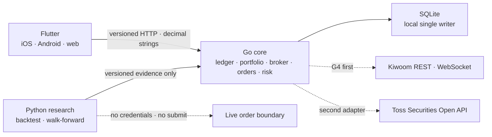

# Omni-Folio

개인용 멀티 증권 포트폴리오와 안전한 자동매매를 위한 local-first 플랫폼입니다. Flutter 하나로 iOS·Android·web을 제공하고, Go가 원장·브로커·주문·리스크의 권한을 소유하며, Python은 재현 가능한 연구와 백테스트만 담당합니다.

> [!IMPORTANT]
> 현재 실거래와 브로커 연결은 비활성입니다. 이 저장소의 백테스트·전략 결과는 수익을 보장하지 않으며 투자 조언이 아닙니다.

## 현재 상태

| Gate | 상태 | 증거 |
|---|---|---|
| G0 아키텍처·계약 | 통과 | versioned OpenAPI/JSON Schema, runtime ADR, root commands |
| G1 로컬 원장 | 통과 | CSV preview → atomic apply → append-only ledger → snapshot/receipt → backup/restore |
| G2 Flutter client | 부분 통과 | iOS·Android·web release build와 17개 자동 테스트 통과; chart 포함 Android emulator build/raster p95 2회 통과, physical-device·수동 screen-reader 및 test-instrumentation 격리 증거 남음 |
| G3 research | 통과 | deterministic backtest, expanding walk-forward, final holdout, paper-only result |
| G4 broker·chart·order | 진행 중 | K0 read, local sample OHLCV/Flutter 차트, K1 credential-free candle, G4D price basis, G4E/K2A 내부 합성 주문 상태·backup v2, G4F/K2B0 알려진 주문 체결 조정, G4G/K2B1 날짜 지정 체결 스캔 합성 계약 통과. 실제 키움 credentialed 시세/모의주문 transport, unknown-submit correlation, public 주문 UI, 실제 risk/fencing, 실시간과 모든 live gate는 남는다. |

세부 상태와 완료 조건은 [`PLAN.md`](PLAN.md)와 [`GATES.md`](GATES.md)에서 관리합니다.

## 아키텍처



- Flutter와 Python에는 증권사 credential이나 주문 제출 권한이 없습니다.
- Go core만 canonical 원장과 주문 상태를 변경할 수 있습니다.
- SQLite는 로컬 단일 writer 단계의 의도적인 선택입니다. PostgreSQL migration·restore·load evidence 전에는 multi-replica나 Kubernetes manifest를 만들지 않습니다.
- 토스증권의 쉬운 용어와 차분한 정보 위계를 참고하되 화면·상표·trade dress는 복제하지 않습니다.

결정 근거는 [`docs/adr/0001-runtime-and-monorepo.md`](docs/adr/0001-runtime-and-monorepo.md), 브로커 순서와 UX 계약은 [`docs/broker-priority-and-ux.md`](docs/broker-priority-and-ux.md)를 따릅니다.

## 빠른 시작

필요한 도구:

- GNU Make 3.81+
- asdf 0.20+
- `curl`
- Docker Engine + Compose v2 (컨테이너 실행 시에만 필요)

프로젝트의 [`.tool-versions`](.tool-versions)는 Flutter 3.47.1 stable, Go 1.24.5, Python 3.14.5를 고정합니다. Python research runtime에는 제3자 패키지가 없습니다.

```sh
git clone https://github.com/YouSangSon/Omni-Folio.git
cd Omni-Folio
asdf install
make bootstrap
make check
make smoke
```

`make smoke`는 임시 SQLite 파일에서 health, readiness, CSV preview, atomic apply, snapshot, local sample OHLCV를 확인하고 종료할 때 데이터를 제거합니다.

### 앱 실행

첫 번째 터미널:

```sh
make run-core WEB_ORIGIN=http://localhost:8081
```

두 번째 터미널:

```sh
make run-client
```

- API: `http://127.0.0.1:8080`
- Flutter web: `http://localhost:8081`
- local DB: `data/omni-folio.db`

`make run-core`는 `contracts/fixtures/market-bars.csv`를 명시적으로 전달하므로 AAPL 보유 항목에서 샘플 종목 차트를 확인할 수 있습니다. 화면과 API 모두 이를 `샘플 데이터 · 실시간 아님`으로 표시합니다. fixture 없이 fail-closed 동작을 확인하려면 `make run-core MARKET_FIXTURE=`를 사용합니다.

다른 API 포트를 사용할 때는 core와 client를 함께 바꿉니다.

```sh
make run-core CORE_ADDR=127.0.0.1:18080 WEB_ORIGIN=http://localhost:8081
make run-client API_URL=http://127.0.0.1:18080
```

`OMNI_API_URL`은 Flutter build-time 값이며 secret을 넣으면 안 됩니다. Make는 `.env`를 자동으로 읽지 않습니다.

## 검증 가능한 수직 슬라이스

### CSV import

Preview는 원장을 변경하지 않습니다. 반환된 `preview_id`를 새 idempotency key와 함께 apply합니다.

```sh
preview_file="$(mktemp)"
curl -fsS -X POST \
  -H 'Content-Type: text/csv' \
  --data-binary @contracts/fixtures/golden-import.csv \
  http://127.0.0.1:8080/v1/imports/preview > "$preview_file"

preview_id="$(python3 -c 'import json,sys; print(json.load(open(sys.argv[1]))["preview_id"])' "$preview_file")"
curl -fsS -X POST \
  -H 'Content-Type: application/json' \
  --data "{\"preview_id\":\"$preview_id\",\"idempotency_key\":\"local-apply-001\"}" \
  http://127.0.0.1:8080/v1/imports/apply

curl -fsS http://127.0.0.1:8080/v1/portfolio/snapshot
rm -f "$preview_file"
```

Golden fixture의 기대값은 신규 3행, revision `rev_0000000003`, USD cash `778`, AAPL 6주, cost basis `300.6`입니다. 동적 ID와 timestamp는 매 실행마다 달라집니다.

### Local sample OHLCV chart

```sh
curl -fsS 'http://127.0.0.1:8080/v1/market-data/candles?symbol=AAPL&interval=1d'
```

응답은 canonical decimal string과 함께 `price_adjustment=unspecified`, `source=local_fixture`, `sample=true`, `state=stale`를 반환합니다. 보유 화면에서 AAPL을 열면 가격·거래량 chart, 가격 조정 기준, source/as-of, screen-reader summary와 정확한 OHLCV 표를 볼 수 있습니다. `unspecified`는 가격 조정 여부를 확인하지 못했다는 뜻입니다. 이 fixture는 계약·UI 검증용이며 현재 시세나 투자 판단 자료가 아닙니다.

### Internal synthetic order recovery, reconciliation, and dated execution scan

K2A/K2B0는 Go 내부에서 Kiwoom `LIMIT`/`KRW`/`KRX` intent와 append-only lifecycle, `SUBMIT_UNKNOWN` 중복 방지, cancel/fill replay, order-aware backup v2와 이미 알려진 주문번호의 원자적 체결 조정을 검증합니다. K2B1은 별도로 명시 날짜의 synthetic `kt00009` KRX 현금 매수·매도 체결 row를 읽고 provider 주문유형을 그대로 보존하는 non-joinable scan만 검증합니다. 세 계약 모두 주문 API나 화면을 노출하지 않고 broker 요청도 보내지 않습니다.

```sh
cd services/core
go test -run '^(TestK2A|TestK2B0|TestK2B1)' -count=1 ./...
```

K2B0는 속성·시간이 같은 주문이 보여도 주문번호 없는 `SUBMIT_UNKNOWN`을 결합하지 않습니다. K2B1의 terminal pagination도 전체 체결 이력 완료를 뜻하지 않으며, 날짜와 timezone 없는 체결 시각을 합쳐 UTC를 만들거나 K2B0 입력으로 사용하지 않습니다. 실제 키움 모의주문 submit/query, 안전한 unknown-submit correlation, risk policy, fencing, broker/ledger reconciliation과 Flutter 주문 흐름은 K2B 범위입니다.

### Research와 자동 개선

```sh
make run-research
make run-improvement
```

전략 개선 runner는 유한한 long-only SMA 후보를 expanding walk-forward로 평가하고 final holdout을 한 번만 엽니다. 결과는 `paper_candidate` 또는 `no_promotion`만 만들 수 있으며 credential·주문·live 승격 권한을 얻지 못합니다.

## 주요 명령

```text
make bootstrap        로컬 dependency 준비
make format           Go/Dart format 적용
make lint             Go vet, Flutter analyze, Python compile 검사
make test             Go, Flutter, Python 단위 테스트
make check            format, lint, test, JSON contract 검사
make smoke            임시 DB 기반 ledger·local market HTTP 수직 슬라이스 검사
make run-core         migrate 후 local Go API와 명시적 sample market fixture 실행
make run-client       Flutter web client 실행
make run-research     deterministic backtest fixture 실행
make run-improvement  walk-forward strategy fixture 실행
```

## 컨테이너 실행

```sh
cp .env.example .env
docker compose -f infra/compose.yaml up --build
curl -fsS http://127.0.0.1:8080/readyz
docker compose -f infra/compose.yaml down
```

Compose는 one-shot migration 뒤 non-root/read-only core를 실행하고 API를 loopback에만 공개합니다. 인증·TLS가 없으므로 외부 네트워크나 cloud 배포에 사용하면 안 됩니다. Named volume은 `down` 뒤에도 유지됩니다. `down -v`는 로컬 원장 데이터를 의도적으로 삭제할 때만 사용하세요.

## 저장소 구조

```text
apps/client/       Flutter iOS · Android · web client
services/core/     Go ledger/API authority
services/research/ Python backtest and strategy improvement
contracts/         OpenAPI, JSON Schema, cross-runtime fixtures
gates/             단계별 acceptance와 evidence
infra/             local OCI/Compose profile
docs/              목표, ADR, research, broker/UX 문서
```

문서는 [`docs/README.md`](docs/README.md)에서 목적별로 찾을 수 있습니다. 보안 취약점이나 credential 노출은 공개 이슈에 붙이지 말고 [`SECURITY.md`](SECURITY.md)의 절차를 따르세요.

## 문제 해결

- `go: go.mod file not found`: 저장소 루트에서 `make bootstrap` 또는 root Make 명령을 사용합니다.
- Flutter device/package 오류: `flutter doctor`, `cd apps/client && flutter pub get`을 실행합니다. Chrome이 없으면 `FLUTTER_DEVICE=web-server make run-client`를 사용합니다.
- `8080` 포트 충돌: 위의 `18080` 예시처럼 core와 `API_URL`을 함께 바꿉니다.
- 브라우저 API 실패: Flutter host/port와 `WEB_ORIGIN`을 정확히 맞춥니다. wildcard CORS는 지원하지 않습니다.
- Compose `unhealthy`: `docker compose -f infra/compose.yaml logs core`로 `/readyz` 실패를 확인합니다.
- SQLite 이동/백업: core를 먼저 중지합니다. `*.db-wal`과 `*.db-shm`은 같은 DB의 runtime sidecar입니다.

## 안전 원칙

- 실거래는 기본적으로 꺼져 있고 UI 토글이나 환경변수 하나로 켤 수 없습니다.
- broker secret, access token, 실제 계좌번호, 원본 거래 export를 Git·fixture·로그에 넣지 않습니다.
- K2A는 timeout/crash 뒤 주문을 `SUBMIT_UNKNOWN`으로 보존하고 같은 주문과 해당 계좌의 신규 submit을 차단합니다. K2B0는 이미 ACK된 주문의 체결만 조정하며, K2B1 dated scan을 포함해 broker가 보장하지 않은 조회 결과로 unknown을 확정하지 않습니다.
- 전략은 수익률만으로 승격하지 않습니다. 비용·지연·데이터 누수·drawdown·운영 건강과 owner 승인이 필요합니다.
- 먼저 생존성과 복구 가능성을 증명합니다. 수익은 보장할 수 없습니다.

## 라이선스

현재 별도 오픈소스 라이선스를 부여하지 않았습니다. 저장소의 공개 열람 가능 여부와 코드 재사용 권한은 동일하지 않습니다.
